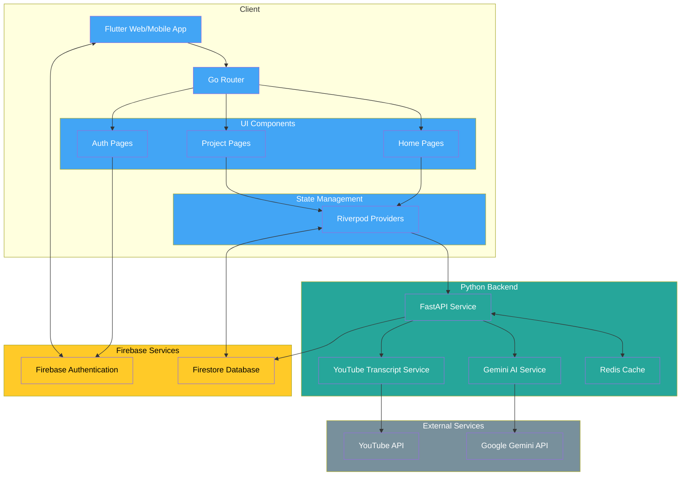

# Commitz

<p align="center">
  
</p>

Convert YouTube videos into smart GitHub issues with AI-powered analysis.

## Overview

Commitz is a modern Flutter application that transforms educational YouTube videos into structured GitHub issues. By leveraging Google's Gemini AI technology, Commitz extracts knowledge from video content and creates well-formatted issues complete with learning objectives, implementation steps, and best practices.

## Features

- **YouTube Video Processing**: Extract and analyze transcripts from any YouTube video
- **AI-Powered Issue Generation**: Convert video content into well-structured GitHub issues
- **Responsive Design**: Works across mobile, tablet, and desktop platforms
- **Project Management**: View and manage all your generated projects in one place
- **Secure Authentication**: Firebase authentication for secure user management

## Architecture

Commitz uses a modern architecture with:

- **Frontend**: Flutter framework with Riverpod for state management
- **Backend**: Python FastAPI service for API endpoints
- **AI Processing**: Google Gemini API for natural language processing
- **Caching**: Redis for performance optimization
- **Storage**: Firebase Firestore for project data persistence



## Getting Started

### Prerequisites

- Flutter 3.x (latest stable version)
- Dart SDK
- Firebase project setup
- Python 3.8+ (for backend)
- Docker
- Gemini API Key

### Setup

1. **Clone the repository:**
   ```bash
   git clone https://github.com/deepraj02/commitz.git
   cd commitz
   ```

2. **Env Setup:**
   In the `backend/` directory create a `.env` file and add your Gemini API key
    ```env
    GEMINI_API_KEY= XXXX
    ```
3. **Install Flutter dependencies:**
   ```bash
   flutter pub get
   ```

4. **Set up Firebase:**
   - Create a Firebase project
   - Configure Firebase for Flutter following the [official guide](https://firebase.google.com/docs/flutter/setup)
   - Enable Firebase Authentication and Firestore

5. **Set up and run backend:**
   ```bash
    cd backend && docker compose up -d --build
   ```

6. **Run the Flutter app:**
   ```bash
   flutter run -d chrome
   ```

## Usage

1. **Log in** to your account using Firebase authentication
2. **Create a new project** by providing a project name
3. **Paste a YouTube URL** of an educational/tutorial video
4. **Generate issues** by clicking the "Generate" button
5. **View and manage** your projects and generated issues

## Tech Stack

- **Frontend:**
  - Flutter
  - Riverpod (state management)
  - Freezed (immutable models)
  - Go Router (navigation)
  - Dio (API communication)

- **Backend:**
  - Python
  - FastAPI
  - Google Gemini API
  - YouTube Transcript API
  - Redis

- **Storage/Authentication:**
  - Firebase Authentication
  - Firestore

## Contributing

Contributions are welcome! Please feel free to submit a Pull Request.

1. Fork the repository
2. Create your feature branch (`git checkout -b feature/amazing-feature`)
3. Commit your changes (`git commit -m 'Add some amazing feature'`)
4. Push to the branch (`git push origin feature/amazing-feature`)
5. Open a Pull Request

----