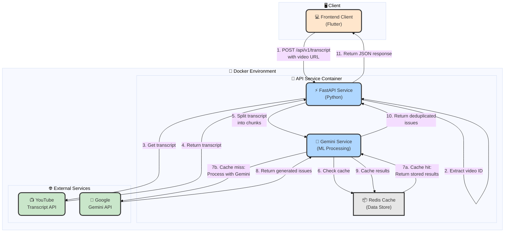

```mermaid
%%{init: {'theme': 'base', 'themeVariables': { 'fontSize': '16px' }, 'flowchart': {'nodeSpacing': 50, 'rankSpacing': 50}}}%%
flowchart TB
    %% Node definitions with more descriptive labels
    subgraph Client["🖥️ Client"]
        FE["💻 Frontend Client\n(Flutter)"]
    end

    subgraph "🐳 Docker Environment"
        subgraph "🔄 API Service Container"
            API["⚡ FastAPI Service\n(Python)"]
            GS["🤖 Gemini Service\n(ML Processing)"]
            Cache["📦 Redis Cache\n(Data Store)"]
        end
        
        subgraph "🌐 External Services"
            YT["📺 YouTube\nTranscript API"]
            Gemini["🧠 Google\nGemini API"]
        end
    end

    %% Flow of data with enhanced styling
    FE -->|"1. POST /api/v1/transcript\nwith video URL"| API
    API -->|"2. Extract video ID"| API
    API -->|"3. Get transcript"| YT
    YT -->|"4. Return transcript"| API
    API -->|"5. Split transcript\ninto chunks"| GS
    GS -->|"6. Check cache"| Cache
    Cache -->|"7a. Cache hit:\nReturn stored results"| GS
    GS -->|"7b. Cache miss:\nProcess with Gemini"| Gemini
    Gemini -->|"8. Return generated issues"| GS
    GS -->|"9. Cache results"| Cache
    GS -->|"10. Return deduplicated\nissues"| API
    API -->|"11. Return JSON response"| FE

    %% Enhanced styling
    classDef container fill:#e6e6e6,stroke:#333,stroke-width:3px;
    classDef service fill:#afd7ff,stroke:#333,stroke-width:3px,rx:10px;
    classDef external fill:#c9e6ca,stroke:#333,stroke-width:3px,rx:10px;
    classDef client fill:#ffe6cc,stroke:#333,stroke-width:3px,rx:10px;
    
    class API,GS service;
    class YT,Gemini external;
    class FE client;
    class Cache container;
```